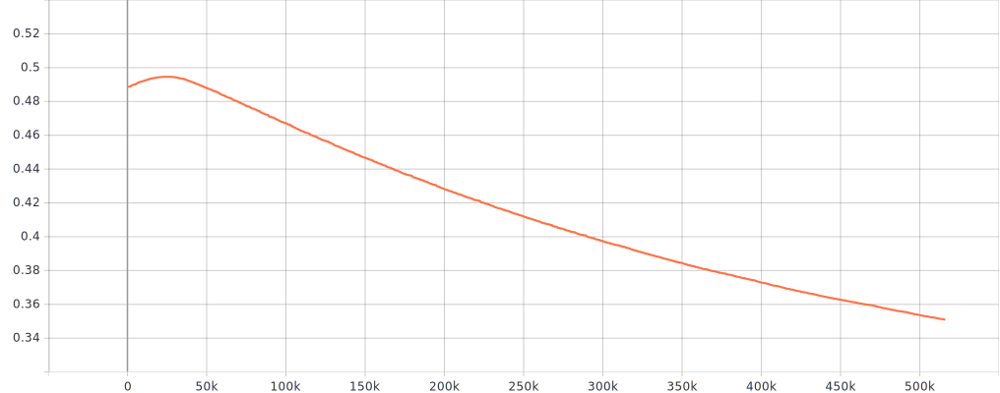
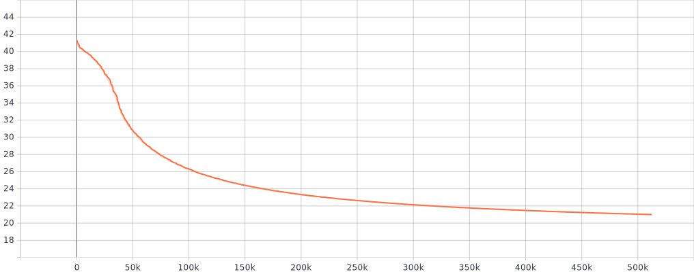

# Training a face Recognizer using ResNet50 + ArcFace in TensorFlow 2.0

The aim of this project is to train an state of art face recognizer using TensorFlow 2.0. The architecture chosen is a modified version of ResNet50 and the loss function used is [ArcFace](https://arxiv.org/pdf/1801.07698.pdf), both originally developed by deepinsight in [mxnet](https://github.com/deepinsight/insightface). The choice of the network was made taking into account that it should have enough complexity to achive good results and that it should be relatively easy trained from scratch. With regard to the loss function, it has been proved that ArcFace is the best loss function for face recognition to date.

The dataset used for training is the CASIA-Webface dataset used in [insightface](https://github.com/deepinsight/insightface), and can be downloaded from their [model zoo](https://github.com/deepinsight/insightface/wiki/Dataset-Zoo). The images are aligned using mtcnn and cropped to 112x112.

The net is trained from scratch using a Tesla P100 and a batch size of 16.  

The results of the training are evaluated with lfw, using the same metrics as deepinsight.

A Dockerfile is also provided with all prerequisites installed.

The full training and testing code is provided.

### Prerequisites

If you are not using the provided dockerfile, you will need to install the following packages:

```
pip3 install tensorflow-gpu==2.0.0b1 pillow mxnet matplotlib==3.0.3 opencv-python==3.4.1.15
```

### Preparing the dataset

Download the CASIA-Webface dataset from [insightface model zoo](https://github.com/deepinsight/insightface/wiki/Dataset-Zoo) and unzip it to the dataset folder.

Convert the dataset to the tensorflow format:

```
cd dataset
mkdir converted_dataset
python3 convert_dataset.py
```

### Training the model

```
python3 train.py
```

The training process can be followed loading the generated log file (in output/logs) with tensorboard. Its important to check that the regularization loss stops growing after a few number of steps.



As the net is trained from scratch, a lot of epochs will be needed to train the model and the loss will vary very slowly.



Its normal that the training accuracy of the model remains 0 after several epochs because of the huge number of classes, so if you want to test the accuracy launch the lfw verification test.

### Launching verification test

The model will be tested using the lfw database. The metrics are the same used in insightface.

Before launching the test set checkpoint path in the verification.py script.

```
python3 verification.py
```

### accuracy

| dbname | accuracy |
| ----- |:-----:|
| lfw |0.9502|

## TODO

- Further training of the net to improve accuracy (not enought training time).
- Add quantization awareness to training. This is not yet possible in TensorFlow 2.0, as commented in [this issue](https://github.com/tensorflow/tensorflow/issues/27880).
- Test other network arquitectures.

## References
1. [InsightFace mxnet](https://github.com/deepinsight/insightface)
2. [InsightFace : Additive Angular Margin Loss for Deep Face Recognition](https://arxiv.org/abs/1801.07698)
3. [InsightFace_TF](https://raw.githubusercontent.com/auroua/InsightFace_TF)
